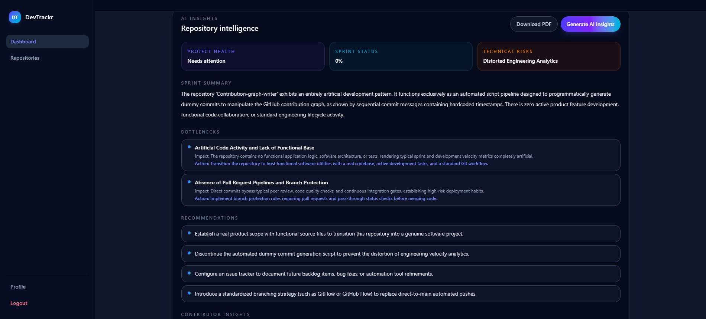
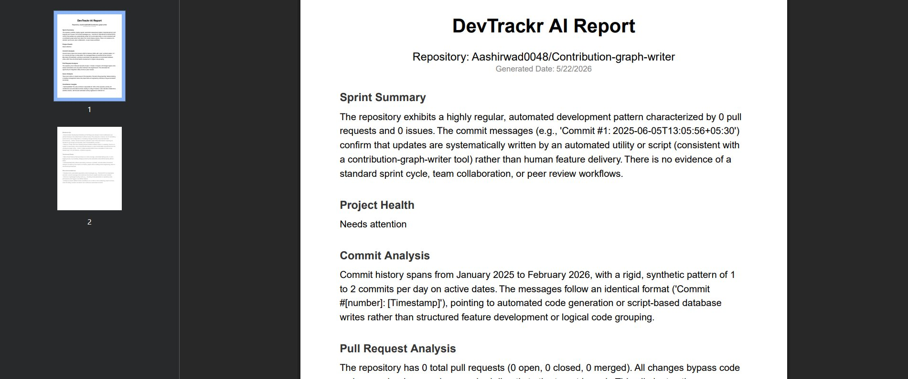
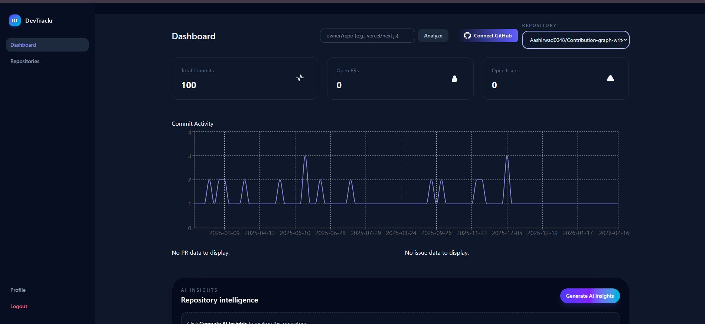

<div align="center">

<br/>


<br/><br/>

<p>
  
  
  
  
  
</p>

<p>
  
  
  
  
</p>

<br/>

> **DevTrackr** is an AI-powered developer productivity and engineering analytics platform.  
> It integrates with GitHub to analyze commits, PRs, and issues — then uses **Google Gemini AI**  
> to surface actionable sprint insights, detect bottlenecks, and export professional PDF reports.

<br/>

**[🚀 Live Demo](https://devtrackr-ai-developer-productivity.onrender.com)** &nbsp;·&nbsp; **[📖 Docs](#-local-setup--installation)** &nbsp;·&nbsp; **[🐛 Report Bug](https://github.com/your-username/DevTrackr/issues)**

<br/>

</div>

---

## 🎬 Demo

<div align="center">


</div>

---

## 📸 Screenshots

<div align="center">

### 📊 Main Analytics Dashboard


<br/>

### 🤖 Gemini AI Insights & Repository Intelligence


<br/>

### 📄 AI-Generated PDF Sprint Report


</div>

---

## ✨ Features

<table>
<tr>
<td width="50%">

### 🔐 GitHub OAuth Integration
Secure multi-tenant architecture where every user connects their own isolated GitHub account via OAuth.

</td>
<td width="50%">

### 🔍 Public Repo Analyzer
Enter any public repository (e.g., `facebook/react`) to instantly analyze engineering velocity — no token required.

</td>
</tr>
<tr>
<td width="50%">

### 🤖 Gemini AI Intelligence
Gemini Flash analyzes commit patterns, sprint progress, and contributor activity to generate strict, actionable engineering insights.

</td>
<td width="50%">

### 📊 Rich Data Visualizations
Beautiful, responsive charts via Recharts — commit frequencies, PR states, issue bug trends, and contributor breakdowns.

</td>
</tr>
<tr>
<td width="50%">

### 📄 PDF Report Generation
One-click professional sprint reports generated server-side using `pdfkit`. Shareable, polished, and printer-ready.

</td>
<td width="50%">

### 🎨 Glassmorphism UI
Modern dark-mode interface built with Tailwind CSS v4, featuring a sleek glassmorphism design system.

</td>
</tr>
</table>

---

## 🏗️ Architecture

```
┌─────────────────┐       ┌──────────────────┐       ┌─────────────────┐
│                 │       │                  │       │                 │
│  React + Vite   │ ────► │  Express.js API  │ ────► │  MongoDB Atlas  │
│  Frontend (UI)  │ ◄──── │  Backend Server  │ ◄──── │  (User Data)    │
│                 │       │                  │       │                 │
└────────┬────────┘       └────────┬─────────┘       └─────────────────┘
         │                         │
         ▼                         ▼
┌─────────────────┐       ┌──────────────────┐
│                 │       │                  │
│   TailwindCSS   │       │  Google Gemini   │
│   & Recharts    │       │  AI / LLM API    │
│                 │       │                  │
└─────────────────┘       └────────┬─────────┘
                                   │
                                   ▼
                          ┌──────────────────┐
                          │   GitHub REST    │
                          │   OAuth API      │
                          └──────────────────┘
```

### How It Works

```
① Auth          →  User signs up / logs in. Passwords hashed via bcrypt. JWT issued.
② GitHub OAuth  →  User connects GitHub. Access token securely stored per-user.
③ Data Fetch    →  Repos, commits, PRs, issues, and contributors pulled via GitHub API.
④ Analytics     →  Raw data processed into metrics: commit frequency, PR states, bug trends.
⑤ AI Analysis   →  Processed data sent to Gemini. Returns insights, risks, recommendations.
⑥ Dashboard     →  Frontend renders analytics and AI insights using Recharts components.
```

---

## 🛠️ Tech Stack

| Layer | Technology |
|-------|-----------|
| **Frontend** | React 18 (Vite), Tailwind CSS v4, React Router DOM v6, Recharts, Axios |
| **Backend** | Node.js, Express.js, PDFKit, Node-Cache |
| **Database** | MongoDB Atlas, Mongoose |
| **AI** | Google Generative AI SDK (`@google/generative-ai`) — Gemini Flash |
| **Auth** | GitHub OAuth, JWT, Bcryptjs |
| **DevOps** | GitHub Actions (CI/CD), Jest (Testing), Render (Deployment) |

---

## 🗄️ Database Schema

DevTrackr uses a lean MongoDB schema. All repository and analytics data is fetched live and cached in-memory via `node-cache`, keeping the database focused purely on user identity.

```json
{
  "_id":         "ObjectId",
  "name":        { "type": "String",  "required": true },
  "email":       { "type": "String",  "required": true, "unique": true },
  "password":    { "type": "String",  "required": true },
  "githubToken": { "type": "String"  },
  "createdAt":   "Timestamp",
  "updatedAt":   "Timestamp"
}
```

---

## 🚀 Local Setup & Installation

### Prerequisites

| Requirement | Version |
|-------------|---------|
| Node.js | v18+ |
| MongoDB | Local or Atlas |
| GitHub OAuth App | [Create one →](https://github.com/settings/developers) |
| Gemini API Key | [Get one →](https://aistudio.google.com/app/apikey) |

---

### 1. Clone the Repository

```bash
git clone https://github.com/your-username/DevTrackr.git
cd DevTrackr
```

### 2. Backend Setup

```bash
cd backend
npm install
```

Create a `.env` file inside the `backend/` directory:

```env
PORT=5000
MONGO_URI=mongodb://127.0.0.1:27017/devtrackr
JWT_SECRET=your_super_secret_jwt_key
GEMINI_API_KEY=your_google_gemini_api_key
GITHUB_CLIENT_ID=your_github_oauth_app_client_id
GITHUB_CLIENT_SECRET=your_github_oauth_app_client_secret
```

Start the development server:

```bash
npm run dev
```

### 3. Frontend Setup

```bash
# In a new terminal
cd frontend
npm install
npm run dev
```

The app will be available at `http://localhost:5173`.

---

## 🧪 Testing & CI/CD

```bash
# Run backend tests
cd backend && npm test
```

This project includes a **GitHub Actions** workflow at `.github/workflows/ci-cd.yml` that automatically:

- ✅ Installs all dependencies
- ✅ Runs the full Jest test suite
- ✅ Builds the frontend
- ✅ Triggers on every `push` and `pull_request`

---

## 📁 Project Structure

```
DevTrackr/
├── backend/
│   ├── routes/           # API route handlers
│   ├── controllers/      # Business logic
│   ├── models/           # Mongoose schemas
│   ├── middleware/        # JWT auth middleware
│   ├── services/         # GitHub API & Gemini AI services
│   └── server.js         # Express entry point
│
├── frontend/
│   ├── src/
│   │   ├── components/   # Reusable UI components
│   │   ├── pages/        # Dashboard, Login, Repositories
│   │   ├── hooks/        # Custom React hooks
│   │   └── main.jsx      # Vite entry point
│   └── index.html
│
└── .github/
    └── workflows/
        └── ci-cd.yml     # GitHub Actions pipeline
```

---

## 🤝 Contributing

Contributions are what make the open-source community such an amazing place to learn and grow. Any contributions you make are **greatly appreciated**.

1. Fork the repository
2. Create your feature branch: `git checkout -b feature/AmazingFeature`
3. Commit your changes: `git commit -m 'Add some AmazingFeature'`
4. Push to the branch: `git push origin feature/AmazingFeature`
5. Open a Pull Request

---

## 📄 License

Distributed under the MIT License. See `LICENSE` for more information.

---

<div align="center">

Built with ❤️ for developer productivity.

**[⬆ Back to top](#)**

</div>
